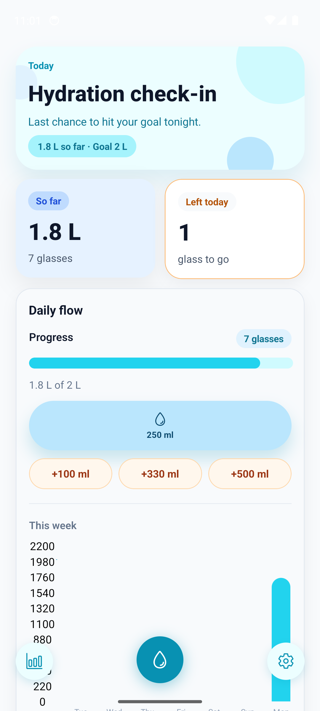
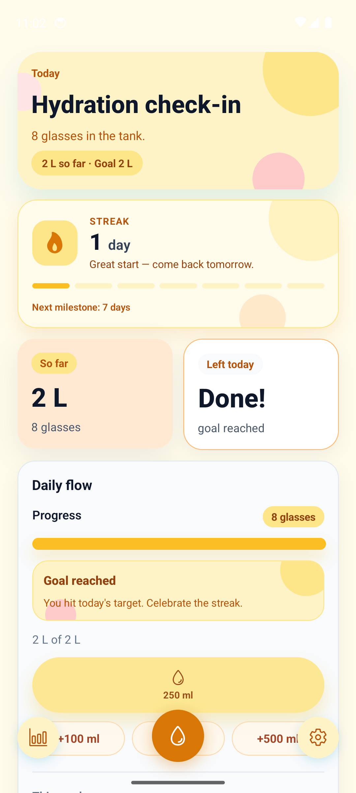
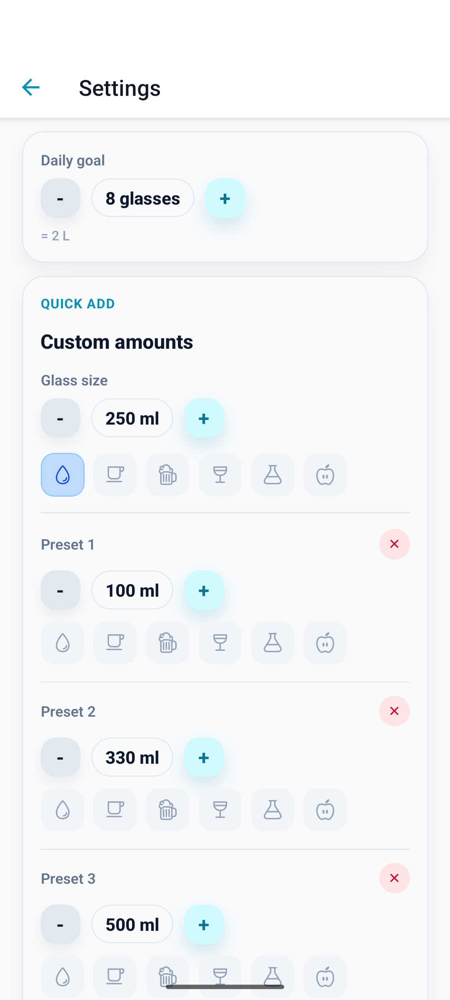

# 💧 Water Reminder

> **Stay hydrated. Every day. Without thinking about it.**

A beautiful, lightweight hydration tracker for Android. Log water with one tap, glance at your streak from the home screen, and let smart reminders nudge you at the right moment — not just on the hour.

[](./RELEASE_NOTES.md)
[](https://play.google.com/store)
[](https://expo.dev)
[](#localization)

---

## Screenshots

<p align="center">
  
  &nbsp;&nbsp;&nbsp;
  
  &nbsp;&nbsp;&nbsp;
  
</p>

---

## Why Water Reminder?

Most hydration apps are bloated. Water Reminder does one thing well: it makes drinking water a habit you actually keep.

- **One tap to log** — open, tap, close. No account, no setup friction.
- **Home screen widget** — see today's intake and streak without opening the app.
- **Drink-aware reminders** — reminders adjust based on how much you've already drunk, not a fixed schedule.
- **Streak system** — daily streaks and at-risk warnings keep you accountable.
- **17 languages** — auto-detects your device locale on first launch.

---

## Features

### Core
- Daily water intake tracker with configurable goal and glass size
- Quick-add buttons (glass size, +100ml) with haptic feedback
- Undo toast — reverse the last log within 4 seconds
- Weekly bar chart for intake history
- Goal-reached warm color theme transition

### Android Home Screen Widgets
- **Main widget** — today's intake progress + preset quick-add buttons + streak count
- **Streak strip** — compact horizontal widget showing current streak at a glance
- Real-time updates on every log tap (no polling delay)
- Midnight auto-reset via scheduled alarm

### Smart Reminders
- Persistent status-bar notification with preset quick-add actions
- Drink-aware scheduling — fewer nudges when you're on track
- Auto-cancel when daily goal is reached; auto-restore when a log is removed
- Restores correctly after device reboot and next-morning launch

### Onboarding
- First-launch wizard for goal and language setup
- Auto language detection from device locale

### Localization
17 languages: Arabic, Bengali, Chinese, French, German, Hindi, Indonesian, Italian, Japanese, Korean, Portuguese, Russian, Spanish, Thai, Turkish, Vietnamese + English

---

## Tech Stack

| Layer | Technology |
|---|---|
| Framework | React Native 0.81 + Expo 54 |
| Navigation | Expo Router 6 (file-system routes) |
| State | Zustand 5 + AsyncStorage persistence |
| UI | Custom StyleSheet, no UI library |
| Charts | react-native-gifted-charts |
| Fonts | DM Sans + Fraunces (Expo Google Fonts) |
| Notifications | expo-notifications |
| Animations | React Native Animated API |
| Build / Deploy | EAS Build + EAS Submit |

---

## Architecture

```
app/
  _layout.tsx          # Root Stack; widget-sync bootstrap on mount
  (home)/
    index.tsx          # Dashboard — progress, chart, quick-add
    settings.tsx       # Goal/glass config, notification toggle, log list
  widget.tsx           # Deep-link handler for Android widget taps

store/
  use-water-store.ts   # Single Zustand store — all logging logic, O(1) daily totals

lib/
  widget.ts            # JS → native bridge (NativeModules.WaterWidget)

components/            # Presentational only; state via useWaterStore or props
  ProgressWidget       # Progress bar + quick-add buttons
  WeeklyChart          # 7-day bar chart
  StreakCard           # Streak display + at-risk banner
  PulseOnChange        # Animation wrapper on value change
  OnboardingWizard     # First-launch flow

android/               # Native Android module (WaterWidget, notifications)
```

**State model:** `logs: WaterLog[]` is append-only (prepend on add, filter on remove). `goalMl` and `glassMl` are user-configurable; changing glass size rescales the goal proportionally. Daily totals are O(1) via cached values — no log scan on every render.

**Widget bridge:** The native `WaterWidget` module syncs state via `syncWidget(payload)` and exposes `consumePendingWidgetAdds()` to drain offline taps recorded while the app was closed. A `flushChain` promise serializes flushes to prevent race conditions.

---

## Getting Started

### Prerequisites
- Node 18+
- Android device or emulator (primary target)
- Expo CLI

### Install

```sh
git clone https://github.com/alperengozum/water-reminder.git
cd water-reminder
npm install
```

### Run

```sh
npx expo start          # scan QR for device / simulator
npx expo start --web    # web preview at http://localhost:8081
npx expo run:android    # build & launch on connected Android device/emulator
```

### Production Build (Android)

```sh
# Build AAB locally
npm run eas:build:android:local   # outputs ./dist/water-reminder.aab

# Submit to Play Store
npm run eas:submit:android
```

---

## Path Alias

`@/` maps to the project root. Use `@/components/...`, `@/lib/...`, `@/store/...` for all cross-directory imports.

---

## Claude Code Skills

Project-specific slash commands for Claude Code (`.claude/commands/`):

| Command | What it does |
|---|---|
| `/product` | Product thinking session — reads current app state, identifies user friction, proposes ranked improvements, picks one to build |
| `/changelog` | Generates Play Store release notes for the current version across 18 locales, ready to paste into Play Console |

Run from Claude Code CLI or any IDE extension while inside this project.

---

## Release Notes

See [RELEASE_NOTES.md](./RELEASE_NOTES.md) for full changelog.

---

## License

Copyright © 2026 Alperen Gözüm

Source available under the [PolyForm Noncommercial License 1.0.0](LICENSE).

- Study, experiment, and learn freely ✅
- Personal and educational use ✅
- Commercial use by others ❌
- Must include copyright notice when distributing ✅
